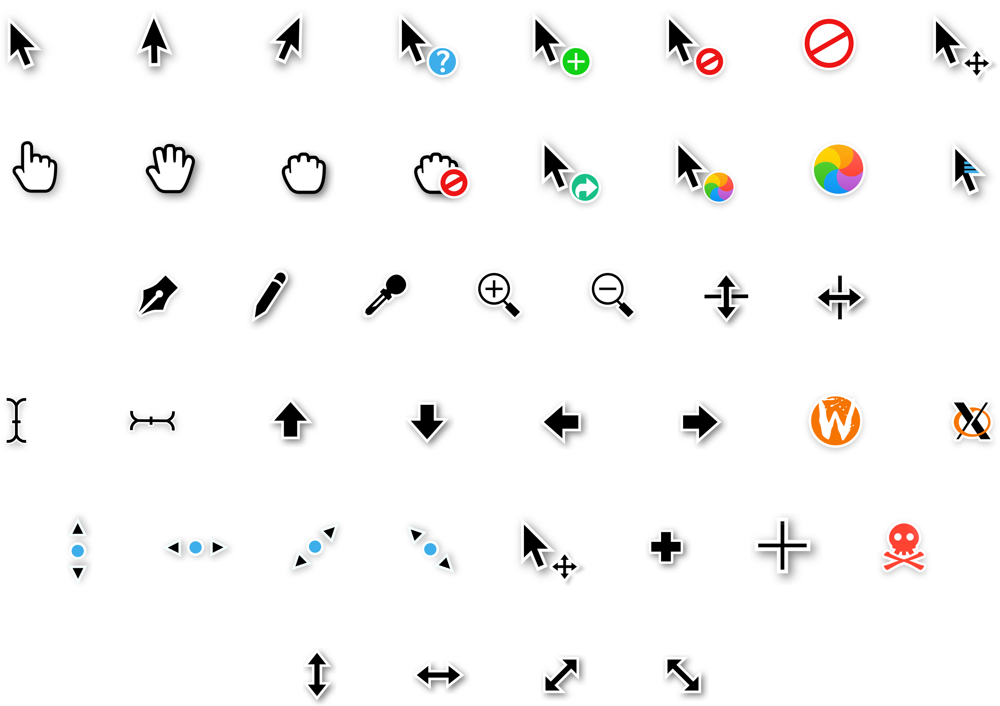

# Captain Frank cursors



This is an x-cursor theme ~copied from~ heavily based on Capitaine cursors and [elementary (redesigned for Linux Mint)](https://github.com/AlessandroBusolin/elementary-cursors-for-Linux-Mint) cursors icon theme.
The source files were made in Inkscape.

## Installation
To install the cursor theme simply copy the compiled theme to your icons
directory. For local user installation:

```
cp -pr dist/ ~/.icons/captain-frank-cursors
```

For system-wide installation for all users:

```
sudo cp -pr dist/ /usr/share/icons/captain-frank-cursors
```

Then set the theme with your preferred desktop tools.


## License
This cursor icon theme is based on Capitaine cursors and elementary (redesigned for Linux Mint), the
former is under the LGPLv3 license and the latter under GPLv3.

I really don't know much about licensing, I hope there is no conflict in licensing this icon theme
under LGPLv3.

Captain Frank cursors is LGPLv3. See COPYING for more details.


## Building from source

Building the x-cursor theme from SVG source requires a regular inkscape
installation. It also needs a command called `xcursorgen`. If the build
script fails, you should probably install inkscape and xcursorgen using
your preferred package manager :)

You'll find everything you need to build and modify this cursor set in
the `src/` directory. To build the xcursor theme from the SVG source
run:

```
./build.sh
```

This will generate the pixmaps and appropriate aliases.
The freshly compiled cursor theme will be located in `dist/`


